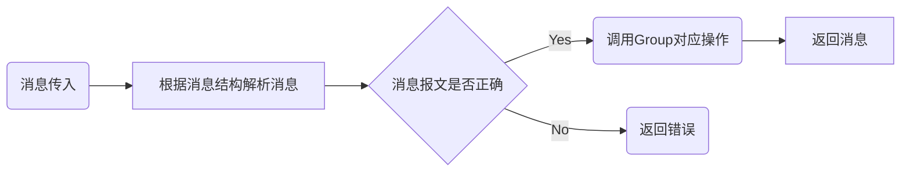
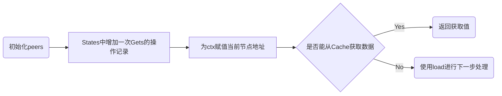
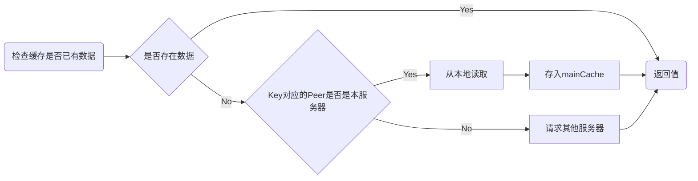
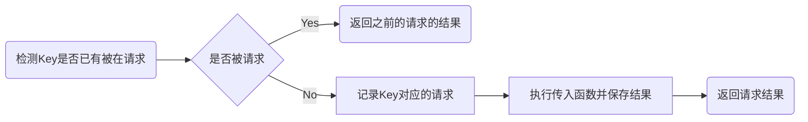

# README

## 项目结构

```
groupfile
├── byteview.py------------------> 包装Byte类型的消息以便在框架内传递
├── client.py--------------------> 客户端
├── consistenthash
│   └── consistenthash.py--------> 一致性哈希
├── encryption
│   ├── AES.py-------------------> AES算法
│   ├── FileCode.py--------------> 对文件使用AES加密的封装
│   ├── RSA.py-------------------> RSA算法
│   └── SHA512.py----------------> SHA512信息摘要算法
├── groupfile.py-----------------> 分布式文件系统主逻辑
├── lru
│   └── lru.py-------------------> LRU缓存
├── main.py----------------------> 程序主函数，定义了如何获取添加数据
├── once.py----------------------> 单例模式
├── peers.py---------------------> 服务器节点
├── singleflight
│   └── singleflight.py----------> 合并请求以限流
├── sinks.py---------------------> 包装ByteView
└── tcp.py-----------------------> 处理tcp消息

```

## 主要完成的部分

分布式文件系统的主逻辑，和对tcp消息信息的处理。

项目的具体运行逻辑如下文所述：

### 接受TCP消息

首先程序定义了自己的消息报文格式，如下:

> ```
> 首先是Head，消息的前8个字节的为整个消息的长度,其次是Body，前三个字节代表消息类型,
> 在请求时有如下几个值：
> GET，获取
> ADD，添加
> DEL，删除
> 在返回时有如下几个值：
> DAT，返回的数据
> SUC，成功
> ERR，失败
> 消息类型后紧跟;号
> 剩下的消息内容则为Key-Value形式，以=分割key和value，以;分割多个键值对
> 消息类型例如：
> 请求值：
> GET;KEY=hello.txt;AES=[123,43223,321,321];GROUP=hello
> ADD;KEY=new.txt;AES=[123,43223,321,321];DAT=12345676
> 返回值：
> DAT;12345679
> ```

在`tcp.py`中定义了`TCPPool`这个类，这个类用来建立TCP服务器，以多线程的方式处理TCP链接，同时储存所有服务器节点的信息，服务器节点使用`tcppeer`来保存，`tcppeer`具有服务器的地址和访问其他远程服务器的`Get`、`Add`等方法。

在`tcp.py`文件中定义了`TCPHandle`实现了`handle`函数以处理接收到的message，`handle`调用助手函数`recv_msg`去摘除头部的消息字节长度，并读取该条消息的所有内容，避免发生粘包。其次`handle`会解析消息的方法，并获取请求消息的参数值。并将消息原文存储到程序运行的上下文`ctx`中。

得到了参数值后，我们可以获得两个重要的值`KEY`，文件的名字和`AES`，经过RSA加密后的密钥，解密后，我们可以得到AES的对对应密钥，如果是GET则是用来加密发送的数据，如果是ADD则是用来解密收到的数据。

我们可以根据参数中的`groupName`通过调用`GetGroup`得到`Group`对象，并调用其`Get`或`Add`方法，对数据进行下一步处理。




### 获取数据

在Group中中有`Get`和`Add`、`Del`等方法,在这里我做了一个处理。使用LRU缓存，来缓存用户读取的文件，这样在许多用户频繁获取某一数据时，这种热数据存储在内存中可以更高效的运行，减少IO导致的性能损失。在Group的cache中使用两部分，一个是`maincache`用来保存通过本服务器节点读取到的任何文件，一个是`hotcache`用来保存从其他服务器读取到数据，以1/10的概率保存从其他服务器获取的数据。

以`GET`为例，简单描述一下所涉及的操作逻辑：

```python
    def Get(self, ctx, key, dest):
        self.initPeers()
        self.Stats.Gets.Add(1)
        if isinstance(ctx, dict):
            ctx['peer'] = self.peers.self
        else:
            ctx = {'peer': self.peers.self}

        if not dest:
						raise Err
        value, cacheHit = self.lookupCache(key)

        if cacheHit:
            self.Stats.CacheHits.Add(1)
            # setSinkView
            setSinkView(dest, value)
            return None
        value, destPopulated, err = self.load(ctx, key, dest)
        if err is not None:
            return err
        if destPopulated:
            return None
        return setSinkView(dest, value)

```




函数首先会初始化`peers`，并在状态中增加一次`Gets`的操作记录，紧接着为上下文`ctx`赋值为当前节点的地址，`dest`为保存返回值的容器。首先使用`lookupCache`去从`Cache`中获取，如果获取不到，则使用`load`去进行下一步处理。

```python
    def load(self, ctx, key, dest):
        self.Stats.Loads.Add(1)
        destPopulate = [False]

        def func():
            value, cacheHit = self.lookupCache(key)
            if cacheHit:
                self.Stats.CacheHits.Add(1)
                return value, None
            self.Stats.LoadsDeduped.Add(1)
            peer, ok = self.peers.PickPeer(key)
            if ok:
                value, err = self.getFromPeer(ctx, peer, key)
                if not err:
                    self.Stats.PeerLoads.Add(1)
                    return value, None
                self.Stats.PeerErrors.Add(1)
            value, err = self.getLocally(ctx, key, dest)
            if err:
                self.Stats.LocalLoadErrs.Add(1)
                return None, err
            self.Stats.LocalLoads.Add(1)
            destPopulate[0] = True
            self.populateCache(key, value, self.mainCache)
            return value, None
        viewi, err = self.loadGroup.Do(key, func)
        if err is None:
            return viewi, destPopulate[0], None
        return None, destPopulate[0], err

```




 在`load`中使用了`loadGroup.Do`做了一个限流，使其对同一个key的tcp请求只能同时执行一个，因此，在执行的时候`load`的内容时，需要再寻找一次缓存，以便之前有请求将数据保存在缓存时，可以直接从缓存读取。当第二次从缓存未命中时，则需要开始从本地读取数据或从其他服务器节点请求。使用`PickPeer`来判断key对应的服务器是否是当前节点，如果是则返回`peer`和`ok`（值为`True`），此时调用`getFromPeer`从其他服务器获取相应数据。如果在本机，则调用`getLocally`从本地获取数据，并将其保存在`mainCache`中。

```python
 def getFromPeer(self, ctx, peer, key):
        req = {'group': self.name, 'key': key}
        resp = {}
        err = peer.Get(ctx, req, resp)  # TODO return resp
        if err is not None:
            return ByteView(), err
        value = ByteView(b=resp['value'])
        if random.randint(0, 9) == 0:
            self.populateCache(key, value, self.hotCache)
        return valu2e, None

```

`getFromPeer`调用`tcpPeer`的`Get`方法，去向其他服务器请求，并以1/10的概率，将获取到的值保存在`hotCache`当中。

```python
    def forwarding(self, ctx, req, resp):
        # group, key = req['group'], req['key']
        HOST, PORT = self.base.split(':')
        with socket.socket(socket.AF_INET6, socket.SOCK_STREAM) as sock:
            # 发送信息到other peer去获取信息
            sock.connect((HOST, int(PORT)))
            send_msg(sock, ctx['o_msg'])

            data = recv_msg(sock)
            if chr(data[0]) == 'D' and chr(data[1]) == 'A' and chr(data[2]) == 'T' and chr(data[3]) == ';':
                data = data[4:]
                data = decrypt_file((ctx['AES'] * 4).encode('utf-8'), data)
            resp['value'] = data

    def Get(self, ctx, req, resp):
        self.forwarding(ctx, req, resp)
```

`tcpPeer`则会使用`forwarding`将原消息直接转发给其他服务器。

```python
    def getLocally(self, ctx, key, dest):
        err = self.getter(ctx, key, dest)
        if err is not None:
            return ByteView(), err
        return dest.view()
```

`getLocally`中使用 `NewGroup` 中传入的 `getter` 去本地获取数据。

```python
def NewGroup(name, cacheBytes, getter, adder, deleter):
    newGroup(name, cacheBytes, getter, None, adder, deleter)
```


### singleflight

```python

from threading import Condition, Lock


class Caller(object):
    def __init__(self):
        self._cond = Condition()
        self.val = None
        self.err = None
        self.done = False

    def result(self):
        with self._cond:
            while not self.done:
                self._cond.wait()

        if self.err:
            raise self.err

        return self.val

    def notify(self):
        with self._cond:
            self.done = True
            self._cond.notify_all()

class Group(object):
    def __init__(self):
        self.map = {}
        self.lock = Lock()

    def Do(self, key, fn, *args, **kwargs):
        self.lock.acquire()
        if key in self.map:
            caller = self.map[key]
            self.lock.release()
            return caller.result()

        caller = Caller()
        self.map[key] = caller
        self.lock.release()

        try:
            caller.val = fn(*args, **kwargs)
        except Exception as e:
            caller.err = e
        finally:	
            caller.notify()

        self.lock.acquire()
        del self.map[key]
        self.lock.release()

        return caller.result()

```




在`singleGroup`中，有两个类其中Caller`用以保存对应Key的请求值和根据条件做`wait`和`notify`，`Group`则用来保存`Key`对应的`Caller`，并使用`Do`执行传递进去的函数。

在执行的时候，首先会请求锁，检查Key是否拥有对应的`caller`，若有则获取`caller`释放锁，并返回其获取结果。若没有，则会新建`Caller`，并存储至`map`，然后释放锁，执行传入的参数`fn`，并保存其结果，结束时使用`notify`通知其他请求，最后加锁，从`map`中删除,并返回结果。

### 助手类

```python
class Once:
    def __init__(self):
        self.has_run = False

    def run_once(self, f):
        @wraps(f)
        def wrapper(*args, **kwargs):
            if not self.has_run:
                self.has_run = True
                return f(*args, **kwargs)

        return wrapper
```

装饰器`Once`用以实现单例，保证函数只执行过一次。

```python
class ByteView:
    def __init__(self, b=bytes(), s=''):
        self.b = b
        self.s = s

    def Len(self):
        if self.b:
            return len(self.b)
        return len(self.s)

    def __len__(self):
        return self.Len()

    def ByteSlice(self):
        if self.b:
            return self.b[:]
        return bytes(self.s, 'utf-8')

    def String(self):
        if self.b:
            return bytes.decode(self.b)
        return self.s

    def At(self, i):
        if self.b:
            return self.b[i]
        return self.s[i]

    def Slice(self, f, t):
        if self.b:
            return ByteView(b=self.b[f:t])
        return ByteView(s=self.s[f:t])

    def SliceFrom(self, f):
        if self.b:
            return ByteView(b=self.b[f:])
        return ByteView(s=self.s[f:])

    def Equal(self, b2):
        if not b2.b: return self.EqualString(b2.s)
        return self.EqualBytes(b2.b)

    def EqualString(self, s):
        if not self.b:
            return self.s == s
        l = self.Len()
        if len(s) != l:
            return False
        return self.b.decode() == s

    def EqualBytes(self, b2):
        if self.b:
            return self.b.decode() == b2.decode()
        l = self.Len()
        if len(b2) != l:
            return False
        return self.s == b2.decode()

```

`ByteView`用来保存返回的数据。

```Python
from byteview import ByteView


def cloneBytes(b):
    return b[:]


def setSinkView(s, v):
    if hasattr(s, 'setView'):
        return s.setView(v)
    if v.b:
        return s.SetBytes(v.b)
    return s.SetString(v.s)


class StringSink:
    def __init__(self, sp='', v=None):
        self.sp = sp
        self.v = v

    def view(self):
        return self.v

    def SetString(self, v):
        self.v.b = []
        self.v.s = v
        self.sp = v

    def SetBytes(self, v):
        self.SetString(''.join(map(str, v)))


class ByteViewSink:
    def __init__(self):
        self.dst = ByteView()

    def SetString(self, s):
        self.dst = ByteView(s=s)
        return None

    def SetBytes(self, v):
        self.dst = ByteView(b=cloneBytes(v))
        return None

    def setView(self, v):
        self.dst = v
        return None

    def view(self):
        return self.dst, None

```

`Sink`则对`ByteView`进行了一次封装。

## 项目的优点

项目在编写的时候注重了代码与代码之间的低耦合，增加了许多可扩展性。`TCPPool`和`GroupFile`之间的低耦合使得项目可以通过自行编写`UDPPool`，`HTTPPool`等为项目增加其他协议的传输支持，也可以自行编写`DataView`来使项目支持其他类型的数据载体如`protobuf`等。

用户可以通过在`NewGroup`中传参：

```python
groupfile.NewGroup(
    name="fileGroup",
    cacheBytes=64 << 20,
    getter=FileGetter,
    adder=FileAdder,
    deleter=FileDeleter
)
```

灵活简单的实现如何读取，添加、删除服务器节点的本地文件。

```python
def FileGetter(ctx, key, dest):
    with open("./{}/{}".format(ctx['peer'], key), "rb") as f:
        data = f.read()
        dest.SetBytes(data)


def FileAdder(ctx, key, dest, data):
    with open("./{}/{}".format(ctx['peer'], key), "wb") as f:
        f.write(data)


def FileDeleter(ctx, key):
    os.remove("./{}/{}".format(ctx['peer'], key))

```

## 项目总结

我完成的部分主要有以下几点：

- 对其他组员的代码进行拼装整合，如加密、哈希、lru等。
- 灵活可扩展──实现了低耦合的分布式文件存储系统，用户可以自行编写插件，以支持多种协议。
- 使用简单──只需实现三个函数`Get`、`Add`和`Delete`便可以启动服务
- 高性能──使用`lru cache`缓存热点文件和`singleflight`合并对同一key的请求来提高性能

